# ☁️ AWS DevOps Zero to Hero

A comprehensive hands-on learning path for mastering AWS DevOps from fundamentals to advanced concepts. This streamlined repository contains practical projects, real-world examples, and production-ready implementations focused on high-value AWS services.

[](https://aws.amazon.com/)
[](https://aws.amazon.com/devops/)
[](LICENSE)
[](http://makeapullrequest.com)

📺 **Complete YouTube Playlist:** [AWS DevOps Zero to Hero](https://www.youtube.com/playlist?list=PLdpzxOOAlwvLNOxX0RfndiYSt1Le9azze)

---

## 📚 Table of Contents

- [🎯 Learning Path](#-learning-path)
- [📁 Repository Structure](#-repository-structure)
- [🛠️ Prerequisites](#️-prerequisites)
- [🚦 Getting Started](#-getting-started)
- [📖 Course Modules](#-course-modules)
- [🎓 Learning Outcomes](#-learning-outcomes)
- [📊 Progress Tracker](#-progress-tracker)
- [🤝 Contributing](#-contributing)
- [📄 License](#-license)

---

## 🎯 Learning Path

This course takes you from AWS fundamentals to advanced DevOps practices with hands-on projects every step of the way.

```mermaid
graph LR
    A[☁️ AWS Basics] --> B[🔐 IAM & Security]
    B --> C[💻 Compute & Network]
    C --> D[📦 Storage]
    D --> E[🏗️ Infrastructure as Code]
    E --> F[🔄 CI/CD Pipeline]
    F --> G[📊 Monitoring]
    G --> H[⚡ Serverless]
    H --> I[🐳 Containers]
    I --> J[☸️ Kubernetes]
    J --> K[🎯 Production Ready]
```



---

## 📁 Repository Structure

```
aws-devops-zero2pro/
├── 01-aws-fundamentals/          # ☁️ AWS basics and CLI essentials
├── 02-iam-security/              # 🔐 Identity and access management
├── 03-ec2-compute/               # 💻 Virtual servers and compute
├── 04-vpc-networking/            # 🌐 VPC and networking
├── 05-route53-dns/               # 🌍 DNS and domain management
├── 06-s3-storage/                # 📦 Object storage and lifecycle
├── 07-cloudformation-iac/        # 📜 Infrastructure as Code
├── 08-codepipeline-cicd/         # 🔄 Complete CI/CD pipelines
├── 09-codebuild/                 # 🔨 Build automation
├── 10-cloudwatch-monitoring/     # 📊 Monitoring and logging
├── 11-lambda-serverless/         # ⚡ Serverless computing
├── 12-ecr-registry/              # 🐳 Container image registry
├── 13-ecs-containers/            # 📦 Container orchestration
├── 14-eks-kubernetes/            # ☸️ Kubernetes on AWS
├── 15-terraform-iac/             # 🏗️ Terraform IaC
├── interview-questions/          # 💼 Interview preparation
└── scripts/                      # 🔧 Utility scripts
```

---

## 🛠️ Prerequisites

Before starting this course, ensure you have:

- ☁️ **AWS Account** - Free tier eligible ([Sign up here](https://aws.amazon.com/free/))
- 💻 **Basic Linux/Unix knowledge** - Command line familiarity
- 🐧 **Terminal skills** - Comfortable with CLI operations
- 🌐 **Basic networking** - Understanding of IP, DNS, ports
- 🐍 **Python basics** - Helpful but not required
- 📝 **Code editor** - VS Code recommended with AWS extensions

---

## 🚦 Getting Started

### AWS Account Setup

```bash
# 1. Create AWS Account
Visit: https://aws.amazon.com/free/

# 2. Install AWS CLI
pip install awscli

# Or using package manager
# macOS: brew install awscli
# Ubuntu: sudo apt install awscli

# 3. Configure AWS CLI
aws configure
# Enter: Access Key ID, Secret Access Key, Region (us-east-1), Output format (json)

# 4. Verify setup
aws sts get-caller-identity
aws ec2 describe-regions --output table
```

### Repository Setup

```bash
# Clone repository
git clone https://github.com/yourusername/aws-devops-zero2pro.git
cd aws-devops-zero2pro

# Start with module 01
cd 01-aws-fundamentals
cat README.md
```

---

## 📖 Course Modules

### 🎓 Foundation Level (Modules 1-6)

#### 01. ☁️ AWS Fundamentals
**[`01-aws-fundamentals/`](01-aws-fundamentals/)**

Learn cloud computing fundamentals and AWS basics.

**Topics Covered:**
- 📌 Public vs Private cloud concepts
- 🏢 Why companies move to cloud
- 🌐 AWS core services overview
- 🖥️ AWS Management Console navigation
- 💰 Free tier and billing basics
- ⌨️ AWS CLI essentials

**Hands-on Files:**
- [`README.md`](01-aws-fundamentals/README.md) - Complete introduction guide
- [`aws-cli-examples.sh`](01-aws-fundamentals/aws-cli-examples.sh) - 150+ essential CLI commands

**Key Commands:**
```bash
# List all services
aws help

# Check your identity
aws sts get-caller-identity

# List EC2 instances
aws ec2 describe-instances
```

---

#### 02. 🔐 IAM Security
**[`02-iam-security/`](02-iam-security/)**

Master AWS access control and security.

**Topics Covered:**
- 👤 IAM users, groups, and roles
- 📋 Policies and permissions (JSON)
- 🔐 MFA (Multi-Factor Authentication)
- 🎯 Principle of least privilege
- 🔄 Service roles and trust policies
- 🌐 Cross-account access

**Key Concepts:**
- Policy evaluation logic
- Inline vs managed policies
- Resource-based policies
- Permission boundaries

**Best Practices:**
- ✅ Enable MFA for all users
- ✅ Use roles instead of access keys
- ✅ Rotate credentials regularly
- ✅ Follow least privilege principle

---

#### 03. 💻 EC2 Compute
**[`03-ec2-compute/`](03-ec2-compute/)**

Deploy and manage virtual servers in the cloud.

**Topics Covered:**
- 🖥️ EC2 instance types and families
- 🚀 Launching and connecting to instances
- 🔒 Security groups and key pairs
- 💾 EBS volumes and snapshots
- 📊 Instance metadata and user data
- 🔄 Auto Scaling basics

**🎯 Hands-on Project:** Deploy Jenkins on EC2 and access it from the internet

**Instance Types:**
- **t2/t3** - General purpose (burstable)
- **m5** - Balanced compute/memory
- **c5** - Compute optimized
- **r5** - Memory optimized

---

#### 04. 🌐 VPC Networking
**[`04-vpc-networking/`](04-vpc-networking/)**

Design and implement cloud network infrastructure.

**Topics Covered:**
- 🏗️ VPC (Virtual Private Cloud) concepts
- 📡 Subnets (public and private)
- 🛣️ Route tables and routing
- 🌐 Internet Gateway and NAT Gateway
- 🛡️ Network ACLs vs Security Groups
- 🔗 VPC Peering and Transit Gateway

**Architecture Patterns:**
- Single VPC with public/private subnets
- Multi-tier application architecture
- Hub-and-spoke network design

---

#### 05. 🌍 Route53 DNS
**[`05-route53-dns/`](05-route53-dns/)**

Configure domain names and DNS routing.

**Topics Covered:**
- 🌐 Domain registration
- 📝 DNS record types (A, CNAME, MX, TXT)
- 🎯 Routing policies (simple, weighted, latency, failover)
- ❤️ Health checks and monitoring
- ⚖️ DNS-based load balancing

**🎯 Project:** Register and configure a custom domain with health checks

**Routing Policies:**
- **Simple** - Single resource
- **Weighted** - Traffic distribution
- **Latency** - Lowest latency
- **Failover** - Active-passive
- **Geolocation** - Location-based

---

#### 06. 📦 S3 Storage
**[`06-s3-storage/`](06-s3-storage/)**

Master scalable object storage.

**Topics Covered:**
- 🪣 S3 buckets and objects
- 💾 Storage classes (Standard, IA, Glacier, Deep Archive)
- 🔄 Versioning and lifecycle policies
- 🔒 Bucket policies and ACLs
- 🌐 Static website hosting
- 🌍 Cross-region replication
- 🔐 Encryption (SSE-S3, SSE-KMS, SSE-C)

**Storage Classes:**
| Class | Use Case | Retrieval Time |
|-------|----------|----------------|
| Standard | Frequently accessed | Milliseconds |
| IA | Infrequent access | Milliseconds |
| Glacier | Archive | Minutes-hours |
| Deep Archive | Long-term archive | 12 hours |

---

### 🔧 Intermediate Level (Modules 7-11)

#### 07. 📜 CloudFormation IaC
**[`07-cloudformation-iac/`](07-cloudformation-iac/)**

Automate infrastructure provisioning with CloudFormation.

**Topics Covered:**
- 📄 CloudFormation templates (YAML/JSON)
- 📚 Stacks and stack sets
- 🔧 Parameters and outputs
- 🧮 Intrinsic functions (Ref, GetAtt, Sub)
- 🔄 Change sets and drift detection
- 🗺️ Nested stacks and cross-stack references

**Hands-on Files:**
- [`vpc-template.yaml`](07-cloudformation-iac/vpc-template.yaml) - Complete VPC infrastructure (138 lines)
- [`ec2-instance.yaml`](07-cloudformation-iac/ec2-instance.yaml) - EC2 with Apache web server (66 lines)
- [`deploy-commands.sh`](07-cloudformation-iac/deploy-commands.sh) - Deployment automation (54 lines)

**🎯 Project:** Create CloudFormation template for complete application stack

**Template Structure:**
```yaml
AWSTemplateFormatVersion: '2010-09-09'
Description: 'Your description'
Parameters: # Input values
Resources: # AWS resources
Outputs: # Return values
```

---

#### 08. 🔄 CodePipeline CI/CD
**[`08-codepipeline-cicd/`](08-codepipeline-cicd/)**

Build automated deployment pipelines.

**Topics Covered:**
- 🔄 Pipeline stages (Source, Build, Test, Deploy)
- 🔗 Integration with CodeCommit, CodeBuild, CodeDeploy
- ✋ Manual approval actions
- 🎣 Pipeline triggers and webhooks
- 🌍 Cross-region deployments
- 🔙 Rollback strategies

**Hands-on Files:**
- [`buildspec.yml`](08-codepipeline-cicd/buildspec.yml) - CodeBuild specification (43 lines)
- [`pipeline-template.yaml`](08-codepipeline-cicd/pipeline-template.yaml) - Complete CI/CD pipeline (172 lines)

**🎯 Project:** Complete CI/CD pipeline from GitHub to S3 deployment

**Pipeline Stages:**
1. **Source** - GitHub/CodeCommit
2. **Build** - CodeBuild
3. **Test** - Automated testing
4. **Deploy** - CodeDeploy/S3/ECS

---

#### 09. 🔨 CodeBuild
**[`09-codebuild/`](09-codebuild/)**

Automate build and test processes.

**Topics Covered:**
- 🏗️ Build projects and specifications
- 📝 buildspec.yml configuration
- 🐳 Build environments and Docker images
- 📦 Artifacts and caching
- 🔗 Integration with other AWS services
- 🧪 Running tests in build phase

**buildspec.yml Phases:**
- **install** - Install dependencies
- **pre_build** - Pre-build commands
- **build** - Build commands
- **post_build** - Post-build commands

---

#### 10. 📊 CloudWatch Monitoring
**[`10-cloudwatch-monitoring/`](10-cloudwatch-monitoring/)**

Monitor and observe AWS resources.

**Topics Covered:**
- 📈 CloudWatch metrics and dimensions
- 🎯 Custom metrics
- 🚨 Alarms and notifications (SNS)
- 📝 CloudWatch Logs and Log Insights
- 📊 Dashboards and visualizations
- 🔍 Log aggregation and analysis

**🎯 Project:** Set up comprehensive monitoring with alarms and dashboards

**Metric Types:**
- **Standard** - AWS service metrics
- **Custom** - Application metrics
- **High-resolution** - Sub-minute data

---

#### 11. ⚡ Lambda Serverless
**[`11-lambda-serverless/`](11-lambda-serverless/)**

Build serverless applications.

**Topics Covered:**
- ⚡ Lambda functions and runtimes
- 🎯 Event sources and triggers
- 📦 Lambda layers and dependencies
- 🔧 Environment variables and configuration
- 🚀 Performance optimization and cold starts
- 💰 Cost optimization strategies

**Supported Runtimes:**
- Python, Node.js, Java, Go, .NET, Ruby
- Custom runtimes with Lambda layers

**Event Sources:**
- API Gateway, S3, DynamoDB, SNS, SQS, EventBridge

---

### 🚀 Advanced Level (Modules 12-15)

#### 12. 🐳 ECR Registry
**[`12-ecr-registry/`](12-ecr-registry/)**

Manage Docker container images.

**Topics Covered:**
- 📦 ECR repositories and lifecycle policies
- 🔍 Image scanning for vulnerabilities
- 🌍 Cross-region replication
- 🔐 IAM policies for ECR
- 🔄 Integration with CI/CD pipelines
- 🏷️ Image tagging strategies

**🎯 Project:** CI/CD pipeline with automated Docker image builds and scanning

**Lifecycle Policies:**
- Expire old images
- Keep only tagged images
- Limit image count

---

#### 13. 📦 ECS Containers
**[`13-ecs-containers/`](13-ecs-containers/)**

Orchestrate containers at scale.

**Topics Covered:**
- 🏗️ ECS clusters and services
- 📋 Task definitions and containers
- 🚀 Fargate vs EC2 launch types
- 📈 Service auto-scaling
- ⚖️ Load balancer integration (ALB)
- 🔄 Blue/Green deployments

**🎯 Project:** Deploy multi-container application with auto-scaling

**Launch Types:**
| Feature | Fargate | EC2 |
|---------|---------|-----|
| Management | Serverless | Self-managed |
| Pricing | Per task | Per instance |
| Control | Less | More |
| Use Case | Simplicity | Customization |

---

#### 14. ☸️ EKS Kubernetes
**[`14-eks-kubernetes/`](14-eks-kubernetes/)**

Run Kubernetes on AWS.

**Topics Covered:**
- ☸️ EKS cluster creation and management
- 🖥️ Worker nodes and node groups
- 🔧 kubectl and eksctl tools
- 📦 Kubernetes deployments and services
- 🌐 Ingress controllers and load balancers
- 📊 Monitoring with CloudWatch Container Insights

**🎯 Project:** Deploy microservices application on EKS

**Key Components:**
- **Control Plane** - Managed by AWS
- **Data Plane** - Worker nodes (EC2/Fargate)
- **Add-ons** - CoreDNS, kube-proxy, VPC CNI

---

#### 15. 🏗️ Terraform IaC
**[`15-terraform-iac/`](15-terraform-iac/)**

Use Terraform for AWS infrastructure.

**Topics Covered:**
- 🔧 Terraform basics and AWS provider
- 📦 Resources and data sources
- 🔢 Variables and outputs
- 💾 State management (local, S3)
- 📚 Modules and workspaces
- 🔄 Terraform vs CloudFormation

**🎯 Project:** Create VPC and deploy applications across AZs with load balancer

**Terraform Workflow:**
```bash
terraform init    # Initialize
terraform plan    # Preview changes
terraform apply   # Apply changes
terraform destroy # Cleanup
```

---

## 🎓 Learning Outcomes

By completing this course, you will be able to:

✅ **Master** AWS core services and architecture  
✅ **Build** production-ready cloud applications  
✅ **Implement** complete CI/CD pipelines  
✅ **Deploy** containerized applications with ECS and EKS  
✅ **Design** secure and scalable infrastructure  
✅ **Automate** infrastructure with IaC (CloudFormation, Terraform)  
✅ **Monitor** applications with CloudWatch  
✅ **Develop** serverless applications with Lambda  
✅ **Prepare** for AWS DevOps job interviews  
✅ **Follow** AWS Well-Architected Framework principles  

---

## 📊 Progress Tracker

Track your learning journey:

### 🎓 Foundation Level
- [ ] 01. AWS Fundamentals
- [ ] 02. IAM Security
- [ ] 03. EC2 Compute
- [ ] 04. VPC Networking
- [ ] 05. Route53 DNS
- [ ] 06. S3 Storage

### 🔧 Intermediate Level
- [ ] 07. CloudFormation IaC
- [ ] 08. CodePipeline CI/CD
- [ ] 09. CodeBuild
- [ ] 10. CloudWatch Monitoring
- [ ] 11. Lambda Serverless

### 🚀 Advanced Level
- [ ] 12. ECR Registry
- [ ] 13. ECS Containers
- [ ] 14. EKS Kubernetes
- [ ] 15. Terraform IaC

---

## 💡 Best Practices

Throughout this course, you'll learn:

- 🏗️ **Well-Architected Framework** - 5 pillars (Operational Excellence, Security, Reliability, Performance, Cost)
- 🔒 **Security** - IAM best practices, encryption, least privilege
- 💰 **Cost Optimization** - Right-sizing, reserved instances, spot instances
- 📈 **Performance** - Auto-scaling, caching, CDN
- 🔄 **Reliability** - Multi-AZ, backups, disaster recovery
- 📝 **Documentation** - Clear, maintainable infrastructure code
- 🧪 **Testing** - Infrastructure testing and validation

---

## 🤝 Contributing

Contributions are welcome! Please feel free to submit a Pull Request.

### How to Contribute:

1. 🍴 Fork the repository
2. 🌿 Create your feature branch (`git checkout -b feature/AmazingFeature`)
3. 💾 Commit your changes (`git commit -m 'Add some AmazingFeature'`)
4. 📤 Push to the branch (`git push origin feature/AmazingFeature`)
5. 🔃 Open a Pull Request

---

## 📞 Support

If you have any questions or need help:

- 📧 Open an issue in this repository
- 💬 Join the discussion in Issues
- 📚 Check [AWS Documentation](https://docs.aws.amazon.com/)
- 🎥 Watch the [YouTube Playlist](https://www.youtube.com/playlist?list=PLdpzxOOAlwvLNOxX0RfndiYSt1Le9azze)
- 🌐 Visit [AWS Training](https://aws.amazon.com/training/)

---

## 📚 Additional Resources

- 📖 [AWS Documentation](https://docs.aws.amazon.com/)
- 🎓 [AWS Training and Certification](https://aws.amazon.com/training/)
- 📘 [AWS Well-Architected Framework](https://aws.amazon.com/architecture/well-architected/)
- 🎥 [AWS YouTube Channel](https://www.youtube.com/user/AmazonWebServices)
- 💬 [AWS re:Post Community](https://repost.aws/)
- 🐦 [AWS on Twitter](https://twitter.com/awscloud)

---

## 🎯 Next Steps

After completing this course:

1. 📜 **Get AWS Certified:**
   - AWS Certified Solutions Architect - Associate
   - AWS Certified Developer - Associate
   - AWS Certified DevOps Engineer - Professional

2. 🚀 **Build Real Projects:**
   - Deploy production applications
   - Contribute to open source AWS projects
   - Create your DevOps portfolio

3. 💼 **Career Growth:**
   - Apply for AWS DevOps positions
   - Join AWS communities and user groups
   - Continue learning advanced topics (EKS, Step Functions, AppSync)

---

## 📄 License

This project is licensed under the MIT License - see the [LICENSE](LICENSE) file for details.

---

## 🌟 Acknowledgments

- 🙏 AWS Community for excellent documentation
- 👥 Contributors who have helped improve this course
- 🎓 All learners who provide feedback and suggestions
- ❤️ Open source community for continuous support

---

<div align="center">

### ⭐ Star this repository if you find it helpful!

**Happy Learning! ☁️**

Made with ❤️ for the DevOps Community

[](https://github.com/yourusername/aws-devops-zero2pro/stargazers)
[](https://github.com/yourusername/aws-devops-zero2pro/network/members)

</div>
